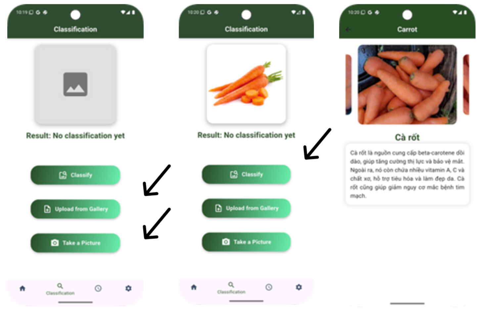

# 🍎 FruitVision App

**FruitVision** là ứng dụng nhận diện hoa quả bằng **AI** (sử dụng mô hình MobileNetV2) và giao diện **Flutter** thân thiện.  
Dự án gồm hai phần chính:
- **`new_model/`**: Huấn luyện và chuyển đổi mô hình học sâu (Deep Learning) để nhận dạng hoa quả.
- **`mobile_app/`**: Ứng dụng di động Flutter tích hợp mô hình đã huấn luyện, giúp người dùng chụp ảnh và phân loại hoa quả nhanh chóng.

---

## 🚀 Tính năng chính
- 📸 **Nhận diện hoa quả bằng hình ảnh** (AI MobileNetV2).  
- 🧠 **Phân loại và hiển thị kết quả trực quan**.  
- 🔥 **Ứng dụng Flutter** với giao diện hiện đại, dễ sử dụng.  
- ☁️ **Kết nối Firebase** để đăng nhập, lưu lịch sử và đồng bộ dữ liệu người dùng.  
- 🧾 **Huấn luyện mô hình riêng** với tập dữ liệu tuỳ chỉnh (Vegetable/Fruit Dataset).  

---

